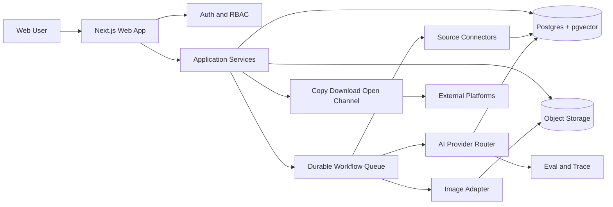

# TaurisWeft PRD

版本：v0.1  
日期：2026-08-20  
品牌状态：**TaurisWeft 为用户确认的项目工作名；正式商标、域名与社交账号清查待完成**
产品阶段：Discovery complete → Focused Team MVP  
交付目标：GitHub repository + Vercel Preview

## 判断标记

- **[已确认]**：用户明确提出。
- **[推断]**：根据已知上下文形成，需后续确认。
- **[建议]**：本 PRD 的产品/技术建议。
- **[待确认]**：未解决不会阻塞原型，但会影响正式上线。

---

## 1. 一句话总结

TaurisWeft 是面向 B2B 专业人士与小型企业团队的 AI 编辑系统，把可信行业研究转化为符合个人职业定位、公司叙事和不同社交平台语境的内容，让用户在约 3 分钟内得到本人愿意署名、只差发布的草稿与配图。

## 2. 背景与机会

### 2.1 背景

**[已确认]** 用户需要持续经营 LinkedIn 专业影响力，并希望把能力扩展到 Facebook、微信朋友圈及未来更多渠道。当前工作被拆散在搜索、通用 AI、文档、设计工具与社交平台之间。

**[已确认]** 团队场景不是让所有员工复制同一篇 Company Post，而是围绕同一事实基础形成产品、销售、技术、市场和国家视角的内容矩阵。

**[已确认]** 用户接受无 API 时的 Copy/Paste，因此产品的核心不是“自动发帖”，而是 **Ready-to-Publish**。

### 2.2 机会

通用 AI 降低了写作成本，却放大了三个新问题：

1. 事实与 source 容易断开，用户不敢直接发布。
2. 文案越来越同质化，难以体现个人经历与专业判断。
3. 团队同时使用 AI 后，更容易重复口径而非形成互补声音。

TaurisWeft 的机会是成为“专业声音的编辑基础设施”，把 source、brand memory、platform profile、review 与 team narrative 组织成可复用工作流。

## 3. 目标用户与画像

### 3.1 Persona A：Founder User / Product Director

- **状态**：[推断，置信度高]
- **角色**：欧洲能源产品负责人，兼顾产品、市场洞察与个人职业品牌。
- **主题**：PV、BESS、Heat Pump、EMS/VPP、动态电价、欧洲市场、AI + Energy。
- **目标**：稳定输出可信观点；优化 Headline、About、Experience 与内容定位。
- **压力**：内容准备耗时；事实错误会损害专业可信度；通用 AI 语气不像本人。
- **成功标准**：每周持续发布；从主题到 Ready 内容约 3 分钟；只需轻度修改。

### 3.2 Persona B：DifferPower Team Member

- **状态**：[已确认方向，待访谈]
- **角色**：销售、市场、技术、国家经理等。
- **目标**：把同一 campaign 转化为符合岗位和市场的个人观点。
- **压力**：不擅长写作、缺少选题、担心公司口径、没有时间配图。
- **成功标准**：能从团队 Research Brief 领取 angle，快速形成不重复的个人内容。

### 3.3 Persona C：Workspace Owner / Marketing Lead

- **状态**：[待验证]
- **目标**：组织 source、company narrative 与 campaign；保证事实一致；减少同质转发。
- **成功标准**：团队内容覆盖多个角度，审批成本可控，外部发布有记录。

### 3.4 角色关系

- MVP 使用者：Founder User + 3–8 名内部团队成员。
- MVP 决策者：Workspace Owner。
- 外部 SaaS 付费者：[待确认] 团队负责人或市场负责人。
- 外部个人付费者：[待确认] 专业人士、顾问、销售与高管。

## 4. 问题定义

### 4.1 Trigger

用户看到新闻、政策、产品资料或 Company Campaign，知道应该表达观点，却没有可立即发布的 angle、source 结构、平台版本和视觉资产。

### 4.2 当前行为

`Search/RSS → ChatGPT/Claude → Docs/Notion → Canva → 手工预览 → Copy/Paste`

### 4.3 具体成本

- 多工具切换和重复复制；实际耗时待观察量化。
- 事实核验依赖个人记忆或重新搜索。
- 个人 voice 每次重新提示，不能持续积累。
- LinkedIn、Facebook、朋友圈版本常被当作翻译问题，而不是语境重写。
- 团队成员围绕同一主题容易重复。
- Profile/CV 与内容定位各自维护，长期不一致。

## 5. 当前替代方案

| 替代方案 | 用户价值 | 缺口 |
|---|---|---|
| 通用 AI 聊天工具 | 快速写草稿 | 缺少持久 Brand Memory、source governance、团队矩阵 |
| Search/RSS/新闻站 | 找到信息 | 不能直接形成个人 angle 与平台内容 |
| Docs/Notion | 编辑与存档 | 不理解 source、claim、platform variant 的结构关系 |
| Canva/图像工具 | 制作视觉 | 与研究事实、文字版本和审批状态割裂 |
| 社交排程工具 | 排期与分发 | 往往不拥有深度 research 与个人职业定位 |
| Employee Advocacy 工具 | 团队分发 | 容易围绕统一素材转发，个人声部仍弱 |
| 人工/代理服务 | 质量可控 | 昂贵、反馈周期长、个人知识难产品化 |

## 6. 需求证据

### 6.1 当前信号

- **中等**：用户把 Profile/CV 优化定义为刚需。
- **中等**：Research → Draft → Image → Preview → Copy 被定义为极度需要。
- **中等**：用户要求 GitHub/Vercel 实施路径，表明愿意投入开发。
- **中等**：接受 Copy/Paste，验证价值目标是 Ready-to-Publish。

### 6.2 缺失信号

- 无外部付费/预付。
- 无 5 人现状流程观察。
- 无量化时间成本和周频率。
- 无团队持续使用或邀请行为。

### 6.3 决策

证据足够建设内部 Focused MVP；不足以建设完整 Platform-first SaaS、Billing 或企业 SSO。

## 7. 最窄切口

### 7.1 第一批用户

一个能源行业 workspace：Founder User + 少量 DifferPower 同事。

### 7.2 最小可验证结果

用户输入一个 URL 或主题后，得到：

1. 有来源的 Research Brief；
2. 一个符合本人 Brand Memory 的专业 angle；
3. LinkedIn 与 WeChat Moments 两个明显不同的版本；
4. 一张可下载的模板化配图；
5. 完整 Preview、Copy 与 Open channel handoff。

### 7.3 故意不做

自动发布、自动互动、Company Page API、Facebook/Instagram/X 全量适配、公开 Billing、复杂 Campaign 编排、实时多人协作、企业 SSO。

## 8. 核心价值主张

### 核心承诺

从可信 source 到本人愿意发布的内容，不从空白页开始，不牺牲个人声音。

### 第一次价值时刻

用户看到同一 Research Brief 生成的 LinkedIn 与朋友圈版本事实一致但语气、结构和长度明显不同，且只需轻度修改即可复制发布。

### 长期价值

每次修改都让 Personal Brand Memory、platform rules 与团队 angle allocation 更贴近真实工作流。

## 9. 产品目标与非目标

### 9.1 MVP 目标

- 验证用户是否愿意每周反复走完 source-to-ready loop。
- 验证 source citation 与 Brand Memory 是否显著降低人工返工。
- 验证 LinkedIn + WeChat 双版本是否比通用 AI 手工改写更快。
- 验证 Profile Optimizer 能否为 Personal Brand Memory 提供高质量初始数据。
- 验证 3–8 人团队能否共享 source 而保留个人 voice。

### 9.2 非目标

- 不以自动发布数量为成功标准。
- 不抓取或自动控制个人社交账号。
- 不承诺增长、viral 或 follower 结果。
- 不做通用 CRM、社交监听或完整营销自动化。
- 不把第一版做成任意行业、任意平台、任意内容类型的开放平台。

## 10. 范围与优先级

### P0：Focused Team MVP

| Capability | 用户价值 | 范围边界 |
|---|---|---|
| Account & Workspace | 可与少量同事共享 | 单 workspace；Owner/Member 两级 |
| Personal Brand Onboarding | 生成更像本人 | 手工表单、粘贴 Profile、上传 CV/PDF |
| Source Ingestion | 从证据开始 | URL、粘贴文本、手工文件；不抓 LinkedIn |
| Research Brief | 形成事实与 angle | source cards、summary、claims、citations |
| Content Studio | 快速成稿 | 一个 Master Content；LinkedIn + WeChat variants |
| Editor & Versioning | 人可控制 | 保存、恢复、锁定段落、AI 局部改写 |
| Visual Asset | 完整交付 | 3 个模板 + 1 次 AI image option；不做全能设计器 |
| Platform Preview | 降低发布不确定性 | LinkedIn desktop/mobile mock；WeChat mobile mock |
| Ready Handoff | 完成核心结果 | Copy text、Download images、Open channel、状态记录 |
| Profile Optimizer | 满足个人刚需 | Headline、About、Experience、Skills、版本保存 |
| Draft Library | 支持复用 | Draft/Review/Ready/Published-manual 状态 |
| Basic Audit | 信任与排错 | 记录 AI run、source、用户确认与外部 handoff |

### P1：V1

- Facebook Page / personal adaptation。
- Company Brand Memory。
- Basic Campaign 与 angle assignment。
- Reviewer 角色、评论与 approval。
- Calendar 与轻量 analytics 手工录入。
- RSS feeds 与 saved source collections。
- Google/Microsoft 登录、团队邀请完善。
- 个人版/团队版试用与基础 Billing。

### P2：V2+

- Company Content Matrix 自动去重与 narrative coverage。
- 官方 LinkedIn Company / Meta / WeChat Official Account API（取决于平台权限）。
- Company Page 建议互动与人工批准。
- X、Instagram、小红书、YouTube 等 adapters。
- Enterprise RBAC、SSO/SAML、审计导出与数据隔离。
- 自动导入内容表现数据与推荐反馈闭环。

## 11. 核心用户路径

### 11.1 Path A：从 Source 到 Ready Content

1. 用户进入 Today，看到空状态或推荐主题。
2. 输入 URL、粘贴材料或写下主题。
3. 系统抓取允许访问的 source，显示标题、作者、日期与状态。
4. AI 生成 Research Brief：facts、claims、unknowns、angles。
5. 用户选择 Personal Brand 与 angle。
6. 系统生成 Master Content、LinkedIn 与 WeChat variants。
7. 用户编辑；可局部执行 Shorter / More technical / More personal。
8. 用户选择模板配图或生成图像。
9. 右侧实时 Preview；系统运行 readiness checks。
10. 用户标记 Ready，Copy text、Download assets、Open target channel。
11. 用户可手工标记 Published，并在未来录入 URL/表现数据。

**失败恢复**：source 抓取失败时保留 URL 并允许粘贴正文；AI 失败时保留 Brief、可 retry/change model/template；离开页面时自动保存草稿。

### 11.2 Path B：Profile Optimizer

1. 用户粘贴 LinkedIn Profile、上传 CV/PDF 或填写表单。
2. 系统解析但不自动发布修改。
3. 用户选择职业定位版本。
4. 系统分析 Headline、About、Experience、Skills、Featured gaps。
5. 每条建议显示理由、缺失证据与可复制版本。
6. 用户接受/编辑/拒绝；接受项写入 Personal Brand Memory。
7. 用户复制到 LinkedIn 或导出 CV draft。

### 11.3 Path C：团队共享 Source

1. Owner 邀请 Member。
2. Owner 创建一个 shared Brief。
3. Member 选择或领取 role angle。
4. 每人基于自己的 Brand Memory 生成个人 variants。
5. 系统提示高度重复的观点或句子。
6. Member 独立决定是否 Ready/Publish；Owner 不能替成员控制个人账号。

## 12. 功能需求与验收标准

### FR-001 Account & Workspace

**用户故事**：作为用户，我需要安全登录并进入正确 workspace，以便个人资料和团队内容不混淆。

**要求**：Email magic link；基础 Google 登录可列 P0.5；Owner 可邀请/移除 Member；所有业务对象带 `workspace_id`。

**验收**：

- 未登录用户不能读取 workspace 数据。
- Member A 不能通过 URL 猜测读取 Member B 的私有 Brand Memory。
- 邀请过期、重复接受和被移除均有明确状态。

### FR-010 Personal Brand Memory

**要求**：保存 role、expertise、audience、content pillars、tone、avoid phrases、language、platform preferences、accepted examples。

**验收**：

- 用户可查看、编辑、导出和删除全部 memory。
- 每次 AI 运行记录使用的 memory version。
- 用户拒绝的表达不会在未解释的情况下继续作为正样本。

### FR-020 Source Ingestion

**要求**：支持 URL、plain text、PDF/DOCX；保存 source metadata、抓取时间、content hash、权限与可引用状态。

**验收**：

- 失败不删除用户输入。
- 重复 URL 通过 hash 提示复用，不无声创建重复 source。
- source 内容不可访问时，允许用户粘贴并明确标为 user-provided。

### FR-030 Research Brief

**要求**：输出 summary、key facts、claims、source links、unknowns、recommended angles、freshness warning。

**验收**：

- 每条事实性 claim 至少关联一个 source 或标记 unsupported。
- 用户可打开 source 并查看支持片段。
- 过期或缺日期 source 显示警告。

### FR-040 Master Content & Variants

**要求**：先生成平台无关的 Master Content，再基于 Personal Brand + Company Brand + Platform Profile 生成 variant。

**验收**：

- LinkedIn 与 WeChat 不是逐句翻译；结构、长度和 opening 符合各自 profile。
- facts 在 variants 间保持一致，opinions 可按 persona 改写。
- 每个 variant 记录 parent master 与 prompt/config version。

### FR-050 Editor

**要求**：富文本/结构化编辑、autosave、undo/redo、version history、局部 AI 操作、段落 lock。

**验收**：

- AI 局部改写不能覆盖 locked blocks。
- 网络中断恢复后不丢失最近已确认版本。
- 用户可比较 AI 初稿与 Ready version 的差异。

### FR-060 Visual Asset

**要求**：Quote Card、Insight Card、Chart Card 三个模板；支持品牌颜色、标题、source note、下载 PNG；可选 AI image generation。

**验收**：

- 导出尺寸符合选定平台 preset。
- 生成失败可回退模板，不阻塞内容 Ready。
- AI image 显示 generated 标记与 prompt history。

### FR-070 Preview & Readiness

**要求**：模拟 LinkedIn 与 WeChat 展示；检查长度、空标题、缺 asset、unsupported claim、重复句、敏感外部动作。

**验收**：

- Preview 与复制内容来自同一 saved version。
- 有 unsupported factual claim 时默认不能显示“Verified Ready”，但用户可带风险说明强制继续。

### FR-080 Publish Handoff

**要求**：Copy text、Download all images、Open channel；记录 handoff，不宣称已发布。

**验收**：

- Copy 成功提供可见反馈。
- Open channel 失败仍保留内容和手动指引。
- 只有用户手工确认或官方 API 回执后才能标记 Published。

### FR-090 Profile Optimizer

**要求**：导入、定位选择、section audit、建议、理由、证据缺口、accept/reject、copy/export。

**验收**：

- 系统不虚构成就、数字或经历。
- 缺少 measurable outcome 时提出问题或 placeholder，不编造。
- 接受的版本可以写入 Brand Memory；原始文件可删除。

### FR-100 Draft Library

**要求**：按 status、platform、topic、author、campaign、date 搜索和过滤。

**验收**：

- 删除进入可恢复 Trash，默认保留 30 天 [建议，待确认]。
- 用户可导出 Markdown/JSON 与 assets。

### FR-110 Team Angle Coordination

**要求**：共享 Brief、选择 angle、显示成员状态、相似度提醒；MVP 不做强制审批。

**验收**：

- Owner 可见 shared Brief 与进度，但默认不可见 Member 标记为 private 的个人草稿。
- 相似度提示给出具体重叠点，不自动阻止发布。

## 13. 非功能需求

### 13.1 性能 [建议目标]

- Dashboard p95 首屏可交互 < 2.5s。
- 普通编辑保存 p95 < 500ms。
- Draft generation 首个状态反馈 < 3s；完整生成 p95 < 45s。
- Research job 超过 15s 转为异步，可离开页面并收到完成通知。

### 13.2 可用性

- MVP 月度可用性目标 99.5%。
- 所有长任务幂等；重复点击不重复扣费或创建多份相同结果。
- 用户输入、accepted edits 与 Ready version 优先保证不丢失。

### 13.3 安全

- HTTPS；数据库与对象存储加密。
- API keys 仅存 Vercel Environment Variables，不进入 GitHub、浏览器 bundle 或日志。
- Workspace 边界在服务端执行；禁止仅靠 UI 隐藏。
- Upload 扫描 MIME、大小与恶意文件；下载使用短时签名 URL。
- 所有外部发布、删除与成员管理动作进入 Audit Log。

### 13.4 隐私与合规

- 明确说明用户上传 Profile/CV、公司资料将如何用于 AI 处理。
- 提供 export、delete、retention control 与模型训练 opt-out 说明。
- 面向欧洲用户按 GDPR 路径设计：lawful basis、DPA、subprocessor list、DSAR、数据删除。
- 不以未授权爬取 LinkedIn Profile 或模拟个人账号浏览器操作作为产品能力。

### 13.5 可访问性

- 目标 WCAG 2.2 AA。
- 键盘完成核心 flow；focus 可见；状态不只依赖颜色；Preview 有文本替代。

### 13.6 可观测性

- 每个 AI run 记录 trace id、task、model/provider、latency、cost estimate、source count、result status。
- 关键事件记录成功/失败原因，不记录 plaintext secrets 或完整敏感文档。

## 14. UX 要求

### 14.1 信息架构

```text
Today
Research
Studio
Library

My Brand
  Profile
  Voice & Style
  Knowledge

Team
  Members
  Shared Briefs
  Campaigns (P1)

Settings
  Workspace
  Channels
  Data & Privacy
```

### 14.2 核心 Editor 布局

- 左：Source / Brief / claim status。
- 中：Master Content 或当前 variant editor。
- 右：Platform Preview / readiness checks。
- 顶：workflow state `Source → Brief → Angle → Draft → Review → Ready`。

### 14.3 状态设计

- **Empty**：示例 Brief + “Paste a source” 主动作。
- **Loading**：显示正在抓取/总结/核验/适配哪个步骤，不显示无限 spinner。
- **AI uncertain**：列出 unsupported claims 与建议下一步。
- **Permission denied**：说明需要的 role 与申请方式。
- **Integration failed**：保留 Copy/Download fallback。
- **Offline/exit**：autosave，恢复时显示 last saved time。

### 14.4 信任设计

- facts、opinions、company claims 使用不同标识。
- Citation 可点开支持片段与原 URL。
- AI 生成与用户编辑版本可比较。
- 外部动作按钮使用明确对象和结果，例如“Copy LinkedIn text”，不写模糊“Continue”。

## 15. 数据需求

### 15.1 核心对象

| Object | Purpose | Key fields |
|---|---|---|
| User | 身份 | id, email, locale |
| Workspace | 团队边界 | id, name, plan, settings |
| Membership | 权限 | user_id, workspace_id, role |
| PersonalBrand | 个人记忆 | positioning, expertise, voice, avoid, version |
| CompanyBrand | 公司叙事（P1） | mission, messages, facts, restricted_claims |
| Source | 原始证据 | url, file, metadata, hash, permission, freshness |
| ResearchBrief | 研究结果 | summary, facts, unknowns, citations |
| Topic/Angle | 内容选择 | pillar, persona, rationale, status |
| MasterContent | 平台无关内容 | thesis, evidence, opinion, CTA |
| ChannelVariant | 平台版本 | channel, language, body, readiness |
| Asset | 图像/文件 | type, storage_url, rights, generated |
| DraftVersion | 可恢复版本 | parent, author, diff, created_at |
| ProfileDocument | CV/Profile 原文 | file, parsed_sections, retention |
| ProfileRecommendation | 优化建议 | section, before, after, rationale, status |
| AIExecution | 模型可观测 | task, provider, model, latency, cost, outcome |
| PublicationHandoff | 外部交接 | channel, copied_at, opened_at, confirmed_url |
| AuditLog | 高风险记录 | actor, action, object, before/after, time |

### 15.2 生命周期

- 原始 Upload 可由用户选择“解析后删除”或保留。
- AI 中间输出按 workspace retention policy 清理。
- Trash 默认 30 天后永久删除 [建议，待确认]。
- Audit Log 的保留期与 plan 分层，MVP 至少 90 天 [建议]。

### 15.3 导入导出

- Import：URL、text、PDF、DOCX、基础 CSV sources。
- Export：Markdown、JSON、PNG/JPG、ZIP assets；Profile 建议可导出 DOCX/PDF 列入 P1。

## 16. AI / 模型需求

### 16.1 AI 角色

- Research synthesis、angle recommendation、draft generation、platform adaptation、image brief/generation、profile analysis、duplicate detection。
- 不让一个无边界 Agent 自主决定并执行发布。

### 16.2 架构原则

- 任务级模型路由，不把品牌绑定单一 provider。
- MVP 使用 workflow + tool calling；不先建设复杂自治 Agent。
- 私有知识使用 Postgres + pgvector 起步；所有 retrieval 带 workspace permission filter。
- 事实生成前先完成 source retrieval；输出结构化 claim/citation mapping。
- 不在 MVP 微调；先积累 accepted edits 与 eval set。

### 16.3 质量指标 [建议初始目标]

| Metric | Target |
|---|---:|
| Factual claims with citation | ≥ 95% |
| Unsupported factual claim rate | < 2% |
| Citation opens correct supporting source | ≥ 95% eval set |
| Ready draft needing major rewrite | < 25% |
| Platform adaptation judged non-literal | ≥ 90% human eval |
| Research-to-draft p95 | < 60s |
| Recoverable AI failure rate | ≥ 99% |
| Cost per Ready output | [待确认，先记录后设阈值] |

### 16.4 Human-in-the-loop

- 事实不确定 → 显示 unknown，不补写。
- Profile 缺成就数据 → 提问/placeholder，不编造。
- 发布/评论/reaction → 默认人工确认。
- 用户可锁定、拒绝、恢复与重新生成。

### 16.5 Eval Harness

最少建立 30 个固定 case：能源新闻 10、公司产品资料 5、个人观点 5、LinkedIn→WeChat adaptation 5、Profile/CV 5。每次模型或 prompt 变更运行 factuality、citation、style、platform fit 与 safety eval。

## 17. 推荐技术栈

```text
前端：Next.js + React + TypeScript + Tailwind CSS + shadcn/ui
后端：Next.js Server Actions / Route Handlers；复杂任务保持模块边界
数据库：Postgres + Drizzle ORM + pgvector
鉴权：Clerk（MVP 快速组织/邀请）或 Auth.js（更低锁定，待团队选择）
AI / 模型层：Vercel AI SDK 类抽象 + provider adapters + structured outputs
文件存储：Vercel Blob 起步；保留 S3-compatible adapter
异步任务：Inngest 或等价 durable workflow
搜索/来源：可替换 Search API + RSS + user-provided sources
图像：模板渲染为默认；image provider 通过 adapter 接入
通知：Email provider；站内任务状态
分析：PostHog 或同类 product analytics
监控：Sentry + Vercel logs + OpenTelemetry trace
部署：GitHub PR → Vercel Preview；main → Production
后台：受 RBAC 保护的 /admin，与用户 UI 共用代码库起步
```

### 为什么适合

- 与 Vercel Preview 路径直接匹配。
- 单仓库、单语言栈提高 MVP 速度。
- Postgres 同时承载关系数据、全文/向量检索与审计索引。
- 模型、搜索、图像与存储均用 adapter，避免早期 vendor lock-in。

### 主要取舍

- Clerk 上线快但有供应商依赖；若数据控制优先，选择 Auth.js。
- Vercel Blob 简单但需提前封装 storage interface。
- Server Actions 适合 MVP；长任务必须交给 durable workflow，不能依赖一次 HTTP 请求。

### 什么时候换方案

- AI/抓取任务超过 serverless execution 边界 → 独立 worker service。
- 向量规模和检索复杂度显著上升 → 专用 search/vector 服务。
- 企业客户要求区域隔离/私有部署 → 分离 control plane 与 data plane。

## 18. 系统架构建议



### 服务模块

- Identity & Workspace
- Brand Memory
- Sources & Research
- Content Studio
- Assets
- Profile Optimizer
- Team Coordination
- Publication Handoff
- AI Gateway & Eval
- Audit & Admin

### 权限边界

每次 DB query 和 retrieval 均带 `workspace_id`；PersonalBrand 与 private drafts 额外带 owner visibility。外部 connector token 与 content 数据分开存储，日志只记录 token reference。

## 19. 权限与角色

### MVP

- **Owner**：workspace settings、邀请、共享 source、查看审计、删除 workspace。
- **Member**：管理自己的 Brand Memory、草稿与 handoff；使用 shared Brief。
- **System Admin**：处理失败任务与 abuse，不默认读取用户内容；break-glass 访问需记录。

### V1

- Admin、Brand Manager、Reviewer、Contributor、External Collaborator。

原则：公司可治理 shared source 和正式 company content，但不能未经成员同意控制其个人账号或私有草稿。

## 20. 集成需求

### P0 必需

- AI text provider。
- Search/RSS/user-provided source adapter。
- Object storage。
- Email/auth provider。
- Vercel/GitHub deployment integration。

### P1 可选

- Google Drive/OneDrive source import。
- Calendar export。
- Product analytics 与 error monitoring。
- Billing。

### P2 条件式

- LinkedIn Company、Meta Pages、WeChat Official Account 等官方 API；只有权限、审核与条款允许时启用。
- 对个人 LinkedIn、Facebook personal、WeChat Moments 保留 Copy/Download/Open 模式。

## 21. 运营后台

运营人员需要：

- 查找 workspace/user（默认只看 metadata）。
- 查看 failed jobs、provider errors、latency、cost。
- retry/cancel job，不能修改用户 Ready content。
- 管理 prompt/config version 与 feature flags。
- 查看 abuse、upload scan 与 quota。
- 处理数据导出/删除请求。
- 查看 audit log；高权限操作二次确认。

## 22. 指标体系

### North Star Metric

**Weekly Ready-to-Publish Outputs (WRPO)**：每周被用户标记 Ready 且完成 Copy/Download/Open handoff 的独立内容数。

它比“生成次数”更接近真实价值，但仍需用后续 Published confirmation 与复用率校准。

### Activation

- 首次 session 内完成一份带 source 的双平台 draft。
- 24 小时内至少一次 Copy/Download handoff。
- 完成 Brand Memory 基础字段。

### Retention

- W1/W4 active creators。
- 每周重复完成 WRPO 的用户比例。
- 团队 shared Brief 被两名以上成员复用的比例。

### Quality

- Ready 前平均人工编辑比例。
- Unsupported factual claim rate。
- Citation correctness。
- Variant differentiation score。
- 用户 accept/reject 与 major rewrite rate。

### Efficiency

- Median Time-to-Ready；目标约 3 分钟 [已确认愿景，待测基线]。
- 每个 Ready output 的模型成本与任务延迟。
- Retry 和 fallback 成功率。

### Business [后续]

- Design partner → paid conversion。
- Seat expansion、team activation、gross margin。

### 风险指标

- 生成量上升但 WRPO/Published 不升。
- Copy 成功但用户不再回来。
- source coverage 下降。
- 团队成员内容重复度上升。
- 高权限外部动作失败或未经确认。

## 23. 边界情况与失败状态

| Case | Expected behavior |
|---|---|
| URL 需要登录/被阻止 | 显示原因，允许 paste text/upload |
| Source 相互矛盾 | 并列冲突，不自动选边，要求用户确认 |
| Source 无日期 | 标记 freshness unknown |
| AI 编造 claim | readiness 阻断 Verified 状态；允许删除/research again |
| 模型超时/限流 | 指数重试，提供 provider fallback，不重复计费 |
| 图像生成失败 | 回退模板卡片，不阻塞文字发布 |
| 用户关闭页面 | autosave；任务在后台继续 |
| 重复点击 Generate | idempotency key 返回同一 job |
| 权限被移除 | 立即撤销 workspace access，保留个人数据导出路径 |
| 邀请链接过期 | 明确过期，Owner 可重新发送 |
| Copy API 被浏览器拒绝 | 选中文字 + 手动复制 fallback |
| Open channel 不可用 | 提供 web URL/移动端步骤，不宣称成功 |
| Profile 缺少数字 | 使用问题/placeholder，不虚构指标 |
| 用户要求自动点赞/群发 | 明确不支持；解释仅提供建议与审批流 |
| 删除 workspace | 二次确认、异步删除、可下载 receipt |

## 24. 前提挑战与替代方案

### 关键前提

1. 用户愿意提供真实 Profile、source 与编辑反馈。
2. Source + Brand Memory 带来的质量差异足以改变现状。
3. Copy/Paste handoff 足够顺滑，不因缺少自动发布而失去价值。
4. 团队需要互补角度，而非统一代写。
5. 内容任务至少每周发生，能形成留存。

### 替代路径

**A. Concierge Validation**：最快、最便宜，但不能验证团队与长期 memory。  
**B. Focused Team MVP**：推荐；能验证核心 loop、Profile 与小团队复用。  
**C. Platform-first SaaS**：暂不推荐；范围、合规和基础设施过大。

## 25. 风险与待验证假设

| Risk | Type | Impact | Validation / Mitigation |
|---|---|---|---|
| 用户只偶尔生成，不形成周留存 | 产品 | 高 | 5 人四周 pilot；看重复 WRPO |
| 通用 AI 已“足够好” | 市场 | 高 | A/B 对比无 memory vs TaurisWeft；测 edit ratio/time |
| Source citation 仍不可信 | AI/数据 | 高 | 固定 eval set、claim mapping、人工抽检 |
| Copy/Paste 仍太麻烦 | UX | 高 | 观察 handoff；移动端 deep link/QR 作为 P1 |
| 团队不愿共享或被统一管理 | 组织 | 高 | private/shared 边界；成员自主发布 |
| Platform API 权限变化 | 集成 | 中 | Channel Adapter；核心价值不依赖 API |
| 上传 CV/公司资料引发隐私顾虑 | 合规 | 高 | 最小化、删除、retention、DPA、加密 |
| AI 成本不可控 | 商业 | 中 | task routing、quota、缓存、cost trace |
| TaurisWeft 名称冲突 | 品牌/法律 | 中 | 正式商标、域名和社交账号清查；未确认前不投入不可逆的正式资产 |
| 多平台范围失控 | 交付 | 高 | P0 仅 LinkedIn + WeChat；adapter contract 先行 |

## 26. Roadmap（建议基线 / 待确认）

### Discovery Validation：48 小时

- 观察 5 名用户的现状流程。
- 记录时间、工具切换、复制次数、核验方式与放弃点。
- 测试一份 source → 双平台 draft 的 Concierge 原型。

### MVP：建议 6–8 周

- Week 1–2：repo、design system、auth/workspace、data model、Vercel Preview。
- Week 2–4：source、Research Brief、AI gateway、citation model。
- Week 4–6：Studio、variants、editor、preview、handoff。
- Week 6–7：Profile Optimizer、template assets、audit/admin。
- Week 8：eval、security review、pilot onboarding、fixes。

该时间仅为建议基线，需根据开发人数、设计成熟度、模型/搜索 provider 与合规要求确认。

### V1：Pilot 后

- Company Brand、Campaign、Reviewer、Facebook adapter、Calendar、基础 analytics。

### V2

- Content Matrix、官方 Page APIs、Billing、扩展渠道、企业 RBAC。

### Long-term

- Professional Digital Identity system：Profile、Content、Network presence 与表现反馈的长期闭环。

## 27. GitHub 与 Vercel Preview 工作流

### Repository

当前仓库沿用 `charltong0429/partbook-app`；待 TaurisWeft 名称清查通过后，再决定是否改为 `taurisweft-app` 以及是否建立独立 GitHub 组织。

```text
app/
  (auth)/
  (product)/today
  (product)/research
  (product)/studio
  (product)/library
  (product)/brand
  (product)/team
  admin/
components/
features/
  brand-memory/
  research/
  studio/
  profile/
  handoff/
lib/
  ai/
  auth/
  db/
  storage/
  observability/
db/
  schema/
  migrations/
evals/
tests/
docs/
```

### Branch / Preview

- `main`：Production-ready branch。
- 每个 feature 使用短分支与 Pull Request。
- 每个 PR 自动生成独立 Vercel Preview URL。
- Preview 使用单独 Environment Variables；数据库至少使用独立 schema/branch，不能写 production 数据。
- Merge 前通过 typecheck、lint、unit/integration、核心 E2E、migration check 与 secret scan。

### Environment Variables

仅记录变量名和去向，不在仓库提交值：

- `DATABASE_URL` → Vercel Preview/Production environment。
- `AUTH_SECRET` / auth provider keys → Vercel encrypted env。
- `AI_PROVIDER_*` → server-only env。
- `SEARCH_PROVIDER_*` → server-only env。
- `BLOB_*` / storage credentials → server-only env。
- `SENTRY_*`, `POSTHOG_*` → 按 client/server 公开范围拆分。

## 28. 测试与发布闸门

### Automated

- Unit：prompt builders、permissions、readiness rules、cost calculation。
- Integration：source ingestion、citation mapping、storage、auth、job idempotency。
- E2E：onboarding → Brief → variants → Ready → Copy；Profile import → recommendation → copy。
- Eval：30 个固定 AI cases；阻止 factuality/citation 回归。

### Manual QA

- Desktop + mobile responsive。
- LinkedIn/WeChat preview visual QA。
- 键盘、screen reader、contrast。
- Vercel Preview 对真实但非敏感 pilot data 测试。

### Release Gate

- 无 P0 security issue。
- 数据导出/删除路径可用。
- 关键 AI eval 达到阈值。
- 外部动作均有 Human Approval。
- Preview 与 production 配置隔离已验证。

## 29. 产品经理建议

1. **最推荐切口**：Founder User + DifferPower 小团队，LinkedIn + WeChat，两种语言/语境最能证明 adaptation 价值。
2. **最应该砍掉**：任何自动发布、自动互动和全平台覆盖；它们会先带来合规与集成成本，却不能证明核心留存。
3. **最关键实验**：比较“通用 AI 手工流程”与 TaurisWeft 在 Time-to-Ready、major rewrite rate、source coverage 和一周后复用上的差异。
4. **最值得提前设计**：Brand Memory versioning、claim-to-source mapping、Channel Adapter、AI eval 与 audit；这些后补成本高。
5. **最容易误判的指标**：生成次数、字数、打开率和点击 Copy。真正指标是 Ready/Published confirmation、周复用与人工修改下降。

## 30. 待确认问题

1. 第一批 pilot 的具体成员、岗位和人数？
2. 当前一周实际发布几次、平均准备多久、使用哪些工具？
3. P0 是否必须同时支持中英双语 UI，还是中文 UI + 中英内容生成？
4. Profile/CV 导入是否包含敏感个人数据，期望保留多久？
5. DifferPower company materials 的保密等级和可用 AI provider 限制？
6. P0 配图更优先模板卡片、图表还是生成式图片？
7. 是否允许 Member 草稿默认 private？Owner 需要看到哪些状态？
8. 期望的 MVP 上线日期、开发人数与预算？
9. 外部 SaaS 的第一付费对象是个人还是团队？
10. TaurisWeft 是否通过口头测试、域名/社交账号核验与正式商标清查，还是需要继续保留备选名？

---

## Definition of MVP Done

MVP 只有在以下条件全部满足时才算完成：

- 真实 pilot 用户能在 Vercel Preview 完成两条核心路径。
- 一份 source 可生成带 citation 的 Research Brief。
- 同一 Master Content 能生成明显不同的 LinkedIn 与 WeChat variants。
- 用户可编辑、恢复版本、预览、复制文字并下载图片。
- Profile Optimizer 不虚构经历或数字，并能更新 Brand Memory。
- Workspace 权限、数据隔离、audit 与删除/导出路径通过测试。
- AI eval、核心 E2E、security review 与 Preview/Production 隔离通过。
- 至少 3 名 pilot 用户在两周内重复完成一次 Ready-to-Publish loop。
