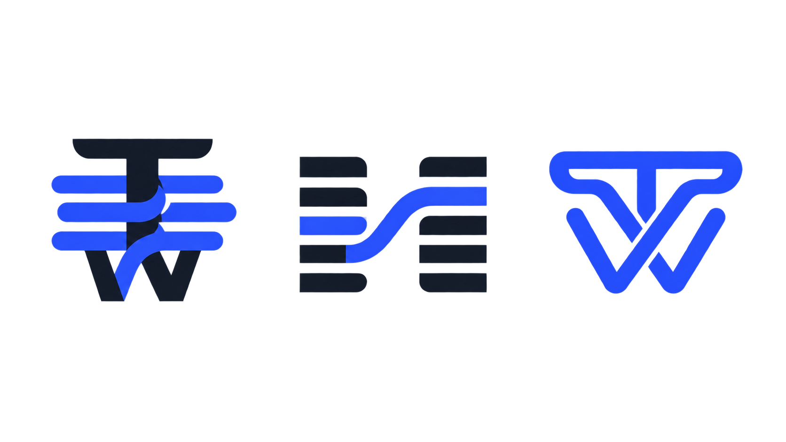
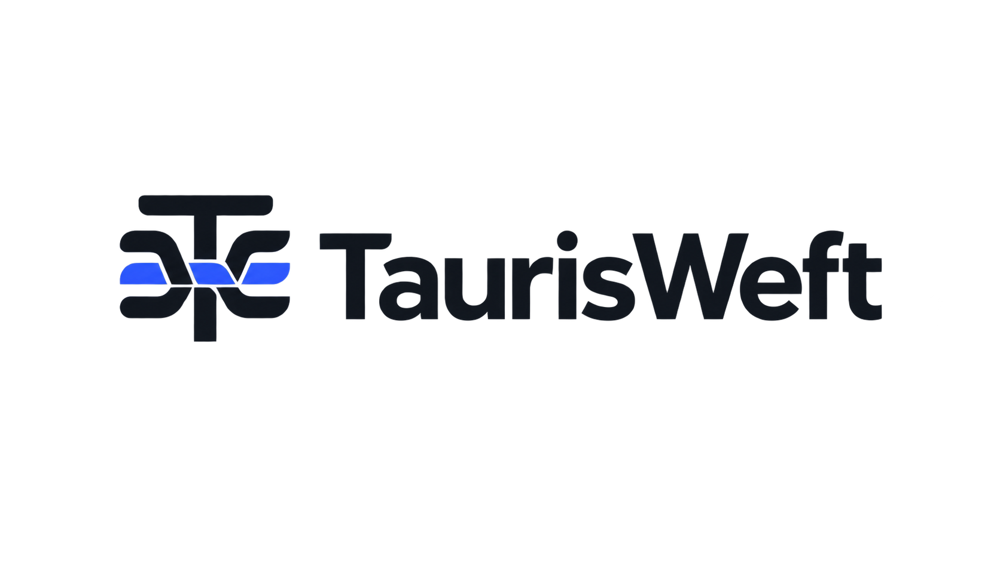

# TaurisWeft Logo Concepts — Round 01

日期：2026-08-20  
阶段：方案 A 已获用户认可；Round 02 SVG 工作资产已建立，不是已注册商标资产

## 设计命题

TaurisWeft 不是“自动发帖机器人”，而是把可信知识编织成不同专业声音的 AI 编辑系统。Logo 需要同时表达稳定、判断、编织与多声部，但不能落入牛头、星座、AI sparkle、聊天气泡或社交平台图标的惯用表达。

## A — Signal Loom（主方向）

- 一根竖向经线构成 `T` 的稳定骨架。
- 三条横向纬线以 over-under 关系穿过中心。
- 交错产生的负空间暗示 `W`，不强行描边字母。
- 远看是独立几何符号，近看才发现 `T + W + weaving` 三层含义。
- 最适合 app icon、favicon、产品页眉和动效。

## B — Editorial Weave（编辑方向）

- 两列短线像 source card 与编辑器文本 rail。
- 一条 Signal Cobalt 线在其中穿行，连接 source、angle、voice 与 channel。
- 更强调编辑系统，弱化 Tauris 的字面联想。
- 适合内容卡片和品牌图形系统，但单独作为 app icon 可能不如 A 集中。

## C — Taurus Trace（力量方向）

- 以一条连续线构成拱形稳定结构，并在内部隐藏 `TW`。
- 只借用平衡和承重感，不出现眼睛、头部、尖角或动物轮廓。
- 必须通过“金融/汽车/体育品牌误读测试”；一旦过于强硬就淘汰。

## 首轮判断标准

1. 16px 是否仍有清晰轮廓。
2. 黑白反转是否成立。
3. 初看不依赖解释，细看有第二层含义。
4. 不像 AI 工具、社交平台、金融公司或手工艺店。
5. 能自然延展为 source line、review state 与 multi-voice 动效。

## 当前建议

用户已认可 A — Signal Loom。Round 02 将结构简化为一根稳定的 `T` 经线与一条连续的 `W` 纬线，以通过小尺寸测试。B 保留为品牌辅助图形语言；C 淘汰。

## Round 02 SVG

- `../../assets/brand/taurisweft-mark.svg`：symbol 工作资产
- `../../assets/brand/taurisweft-lockup.svg`：横向 lockup 工作资产
- `../../favicon.svg`：带 Paper 背景的 favicon 工作资产

## 生产说明

首轮 AI 图仅用于概念判断。选定方向后应重绘为网格化 SVG，并单独制作 symbol、horizontal lockup、monochrome、dark mode、favicon 及 safe-area 版本。
