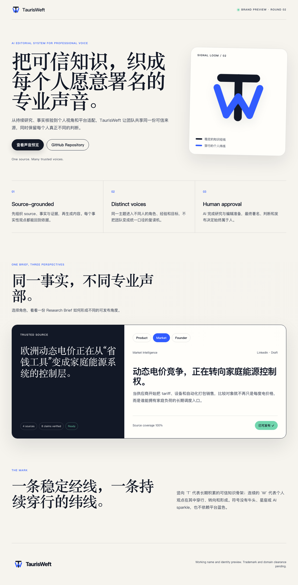

# TaurisWeft Vercel Deploy Report

日期：2026-08-20  
GitHub 仓库：`charltong0429/partbook-app`  
部署提交：`33805de feat: add TaurisWeft Signal Loom preview`

## 结果

- GitHub `main` 推送成功。
- Vercel 项目 `shaochen-jis-projects/taurisweft` 创建并与本地目录链接。
- 显式 Preview 部署状态为 `READY`。
- Preview URL：`https://taurisweft-p40ykb4ps-shaochen-jis-projects.vercel.app`
- Preview Inspector：`https://vercel.com/shaochen-jis-projects/taurisweft/FriyfvPtBE2UXETkDtMdhtzLzS4Y`
- Preview 当前启用 Vercel Login protection；匿名浏览器会跳转到 Vercel 登录页。

## Vercel 首次部署说明

首次执行未带 `--prod` 的 `vercel --yes` 时，Vercel CLI 仍返回 `target: production`，并自动建立公开别名：

- Public URL：`https://taurisweft.vercel.app`
- Deployment ID：`dpl_8URUKTgtG2uJ4GzPX66ggiWkfDds`

没有删除或覆盖该部署。后续 Preview 必须显式使用：

```text
vercel deploy --target preview --yes
```

## Verification

### Automated checks

- `npm run check`：PASS，7 个必需文件存在且品牌、语言、交互和配色断言通过。
- `node --check app.js`：PASS。
- SVG XML validation：PASS。
- `git diff --check`：PASS。

### Browser QA

- 本地桌面、平板、手机响应式截图：PASS。
- Product / Market / Founder voice tabs：PASS。
- “标记为可发布”状态切换：PASS。
- Public URL HTTP：200。
- Public URL 页面正文：完整。
- Public URL console errors：0。
- Public URL browser load：约 1.75 秒。
- Public URL Founder voice：成功显示“用户不需要理解每一个价格波动。”
- Public URL approval state：成功显示“已可发布 ✓”。

## Evidence



线上全页截图保存时，本机磁盘空间不足；错误生成的 Vercel 登录页截图已删除。线上页面与本地页面来自同一提交，线上内容与交互已通过浏览器 canary。

## Verdict

**DEPLOYED AND VERIFIED WITH CONCERN**

页面已上线并通过公开 URL 检查。需要注意两点：显式 Preview 受 Vercel 登录保护；首次 CLI 部署被 Vercel 自动分类为 Production。未来部署应使用明确的 `--target preview` 参数。
